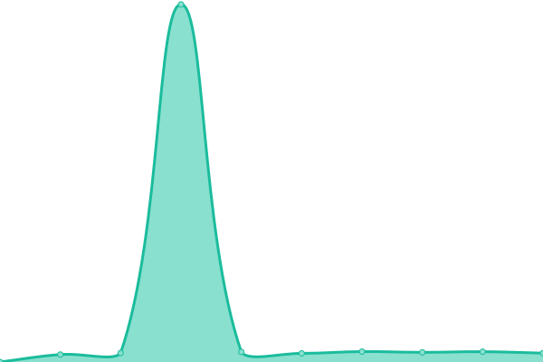
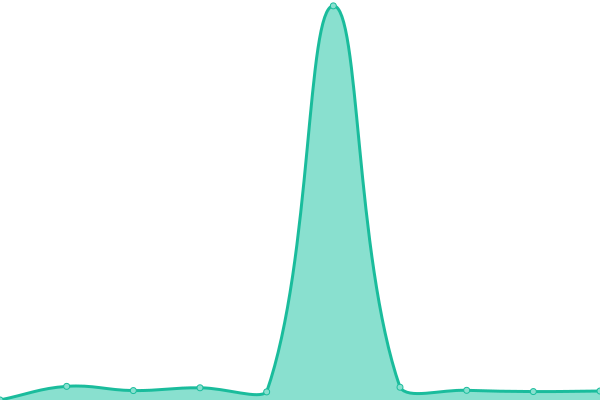

# [📈 Live Status](https://status.jarvisdiscordbot.net): <!--live status--> **🟧 Partial outage**

This repository contains the open-source uptime monitor and status page for [JARVIS-discordbot](https://jarvisdiscordbot.net/), powered by [Upptime](https://github.com/upptime/upptime).

With [Upptime](https://upptime.js.org), you can get your own unlimited and free uptime monitor and status page, powered entirely by a GitHub repository. We use [Issues](https://github.com/JARVIS-discordbot/status/issues) as incident reports, [Actions](https://github.com/JARVIS-discordbot/status/actions) as uptime monitors, and [Pages](https://status.jarvisdiscordbot.net) for the status page.

<!--start: status pages-->
<!-- This summary is generated by Upptime (https://github.com/upptime/upptime) -->
<!-- Do not edit this manually, your changes will be overwritten -->
<!-- prettier-ignore -->
| URL | Status | History | Response Time | Uptime |
| --- | ------ | ------- | ------------- | ------ |
|  [Dashboard](https://dash.jarvisdiscordbot.net) | 🟥 Down | [dashboard.yml](https://github.com/JARVIS-discordbot/status/commits/HEAD/history/dashboard.yml) | 

 2500ms
     
 | 

<a href="https://status.jarvisdiscordbot.net/history/dashboard">99.54%</a>
    

|  [Bot](https://bot.jarvisdiscordbot.net/) | 🟥 Down | [bot.yml](https://github.com/JARVIS-discordbot/status/commits/HEAD/history/bot.yml) | 

 2412ms
     
 | 

<a href="https://status.jarvisdiscordbot.net/history/bot">98.22%</a>
    

|  [BOT landing page](https://jarvisdiscordbot.net) | 🟥 Down | [bot-landing-page.yml](https://github.com/JARVIS-discordbot/status/commits/HEAD/history/bot-landing-page.yml) | 

 2807ms
     
 | 

<a href="https://status.jarvisdiscordbot.net/history/bot-landing-page">99.98%</a>
    

|  [electronenclave.com (My electronics site)](https://electronenclave.com) | 🟩 Up | [electronenclave-com-my-electronics-site.yml](https://github.com/JARVIS-discordbot/status/commits/HEAD/history/electronenclave-com-my-electronics-site.yml) | 

 556ms
     
 | 

<a href="https://status.jarvisdiscordbot.net/history/electronenclave-com-my-electronics-site">85.75%</a>
    

|  [E Number lookup](https://enumbers.jarvisdiscordbot.net/) | 🟥 Down | [e-number-lookup.yml](https://github.com/JARVIS-discordbot/status/commits/HEAD/history/e-number-lookup.yml) | 

 2894ms
     
 | 

<a href="https://status.jarvisdiscordbot.net/history/e-number-lookup">99.99%</a>
    

|  [E Number lookup api](https://enumbers.jarvisdiscordbot.net/api/enumbers) | 🟥 Down | [e-number-lookup-api.yml](https://github.com/JARVIS-discordbot/status/commits/HEAD/history/e-number-lookup-api.yml) | 

 2910ms
     
 | 

<a href="https://status.jarvisdiscordbot.net/history/e-number-lookup-api">100.00%</a>
    

<!--end: status pages-->

[**Visit our status website →**](https://status.jarvisdiscordbot.net)

## 📄 License

- Powered by: [Upptime](https://github.com/upptime/upptime)
- Code: [MIT](./LICENSE) © [Anand Chowdhary](https://anandchowdhary.com), supported by [Pabio](https://pabio.com)
- Data in the `./history` directory: [Open Database License](https://opendatacommons.org/licenses/odbl/1-0/)
